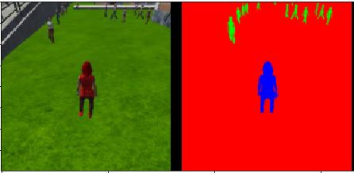
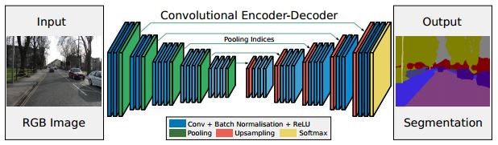
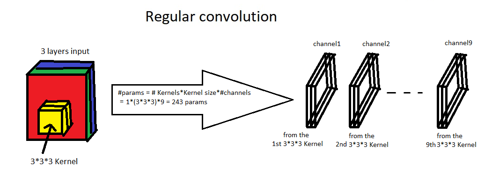
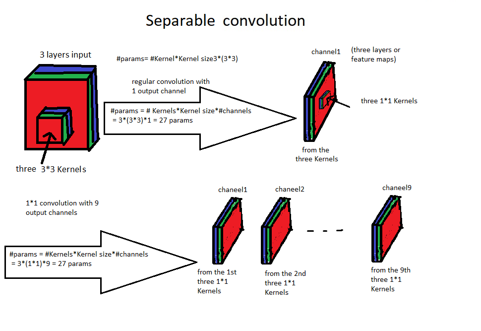
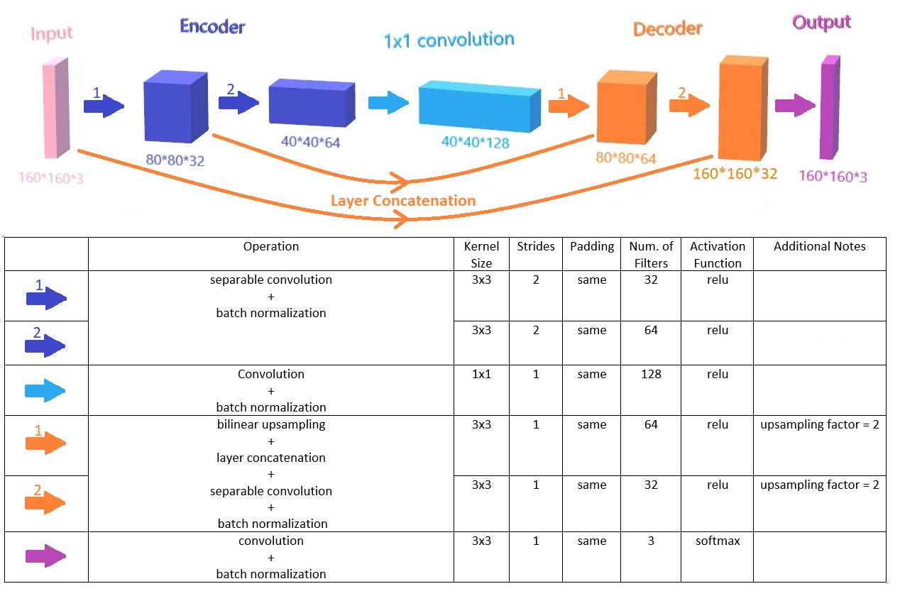
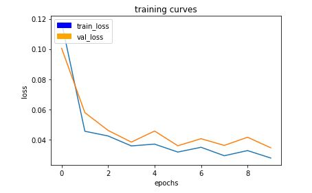
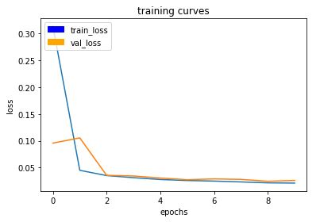

# Project: Follow Me
## Network Architecture
The network is required to perform a semantic segmentation task to classify three classes (the Hero, other people and background including buildings, roads, trees ...)
### Semantic Segmentation
Semantic segmentation is understanding an image at pixel level by assigning each pixel in the image an object class i.e, make a prediction at every pixel.
Semantic segmentation has a wide array of applications ranging from scene understanding, inferring support-relationships among objects to autonomous driving.


### FCNs
Fully Convolutional Networks are commonly used in semantic segmentation. Taking input of 'arbitrary size' and producing correspondingly-sized output.

One advantage that FCNs has over CNNs with fully connected layers, is that CNNS during extracting the features from the image i.e, collecting the 'what' information, it is discarding the 'where' information. However, semantic segmentation needs the 'where' information to be preserved.
One way to preserve such a vital information is using an FCN with encoder-decoder layers and 1x1 convolutions. This FCN consists of an encoder network, a corresponding decoder network followed by a pixel-wise classification layer. U-Net and SegNet are popular networks that use this architecture.


Another advantage of FCNs is that during inference, you can feed images of any size into the trained network.

### Encoder/Decoder
The encoder layer tries to comress or encode the input image by reducing its spatial size and extracting more features. This operation tells us 'what' we have in the image.

After extracting features from input images, the decoder reconstructs (upsamples) the image again, decode those features and generate a semantic segmentation mask. This operation tells us 'where' are the locations of the segmented objects.


### Encoder
It is identical to the convolutional layers. Each encoder in the encoder network performs a separable convolution with a filter bank to produce a set of feature maps. An element-wise rectifiedlinear non-linearity (ReLU) is applied. These feature maps are then batch normalized. Batch normalization adds a bit of regularization and increases the speed of training the networks.
A separable convolution is a convolution performed over each channel of an input layer and followed by a 1x1 convolution. It provides a reduction in the number of parameters. The Encoder Section illustrates the difference between regular convolution and separble convolution with an example, and the two figures below clarify that example.



The reduction in the parameters helps in reducing overfitting and making the network more efficient with improved runtime performance.

The code block below shows the implementation of the Encoder network using `Keras`.
```
def encoder_block(input_layer, filters, strides):
    # separable convolution with RELU
    output_layer = SeparableConv2DKeras(filters=filters,kernel_size=3, strides=strides,
                             padding='same', activation='relu')(input_layer)

    # batch normalization
    output_layer = layers.BatchNormalization()(output_layer)     
    return output_layer
```

### 1x1 convolution
Instead of a fully connected layer that is used in CNNs to classify objects in an image, FCNs uses 1x1 convolution. 1x1 convolutions helps preserve the spatial or 'where' information the information about the location of the pixels, by keeping the 4D shape of its output and not flattening it to 2D as fully connected layers do.

A 1x1 convolution is a regular convolution with a kernel size of 1. Thus, if we have a a 1x1 convolution with a filter depth of K, a 'same' padding and a stride of 1, and we fed it with an input of size H*W*D , the output dimensions would be H*W*K. So A 1x1 concolution is very useful in increasing or reducing the dimensionality of the layer in a very inexpensive way.

Another advantage of using 1x1 convolutions in FCNs instead of a dully connected layer, is that during inference we can feed the network with any arbitrary size of input images.


### Decoder
The role of the decoder network is to map the low resolution encoder feature maps to full input resolution feature
maps for pixel-wise classification.
This operation is called upsampling, and it can be achieved using several techniques such as: transposed convolutions and bilinear upsampling.

### Layer concatenation and skip connection
Layer concatenation and skip connection are used to retain some of the finer details from the previous layers, and combine semantic information from a deep, coarse layer with appearance information from a shallow, fine layer to produce accurate and detailed segmentations. However, it is better to add some other convolution layers to learn those finer spatial details from the previous layers better.

The code block below shows the implementation of the Decoder network.
```
def decoder_block(small_ip_layer, large_ip_layer, filters):
    
    # upsampling the small input layer by a factor of 2
    small_ip_layer_upsampled = BilinearUpSampling2D((2,2))(small_ip_layer)
    
    # Concatenate the upsampled and large input layers
    output_layer = layers.concatenate([small_ip_layer_upsampled, large_ip_layer])
    
    # Add separable convolution layers
    output_layer = separable_conv2d_batchnorm(output_layer, filters, strides=1)
    output_layer = separable_conv2d_batchnorm(output_layer, filters, strides=1)
    
    return output_layer
```


### Softmax Classifier
A trainable Softmax classifier tries to classify each pixel into one of the three classes independently. It is fed with the high dimensional feature output of the final decoder, and outputs a three channel image of probabilities. The predicted segmentation corresponds to the class with maximum probability at each pixel.

### My Model
I have made many training set with many different architectures. And with each training set, I have tried to make sense of the results to enhance the FCN model.

The next fiure shows the final network architecture.



#### number of layers
I began with two layers in the encoder block, then a 1x1 convolution and the two corresponding decoder layers. This model shows very good results, but it was not enough. So I increased number of layers to 3 layers then 4 layers. However, increasing number of parameters requires a lot more of training time to reach the same results of the two layers architecture. Therefore I have adopted the two layers approach.

#### features
For the encoder layers, the number of features increases, while it decreases in the decoder layer, until it reaches 3 in the softmax classifier, which is the number of classes.
As a common settings, number of features is chosen to be a power of 2, for computational reasons and performance improvement, as stated [here in this lecture](https://www.youtube.com/watch?v=LxfUGhug-iQ) by Andrej Karpathy from CS231n (at 00:22:20).

Because I was training the model on my laptop not on a GPU server. The values were also chosen conveniently based on the training time the model takes and the time I actually have.

And this is the implementation of my final model, based on the encoder and decoder blocks stated above.
```
def fcn_model(inputs, num_classes):
    
    # TODO Add Encoder Blocks. 
    # Remember that with each encoder layer, the depth of your model (the number of filters) increases.
    encoder_layer1 = encoder_block(inputs, filters=32, strides=2)
    encoder_layer2 = encoder_block(encoder_layer1, filters=64, strides=2)

    # TODO Add 1x1 Convolution layer using conv2d_batchnorm().
    encoder_layer3 = conv2d_batchnorm(encoder_layer2, filters=128, kernel_size=1, strides=1)
    
    # TODO: Add the same number of Decoder Blocks as the number of Encoder Blocks
    decoder_layer1 = decoder_block(encoder_layer3, encoder_layer1, filters=64)
    decoder_layer2 = decoder_block(decoder_layer1, inputs, filters=32)
    
    x = decoder_layer2
    
    # The function returns the output layer of your model. "x" is the final layer obtained from the last decoder_block()
    return layers.Conv2D(num_classes, 3, activation='softmax', padding='same')(x)
```

## Training dataset
I had some problems with the training results in the first two trials, So I have decided to collect more training and validation data.

I captured lots of images with the copter following the hero, images for each character spawns in the simulator environment and images when the target was far away from the copter.
Consequently, the evaluation results shows a great improvement.


## HyperParameters
### learning rate
Learning rates of 0.1 and 0.01 encounter oscillations in the loss curve.



So I chose a learning rate of 0.001. But after some number of epochs the curve plateaus, so I have used a variable learning rate using `keras.callbacks.LearningRateScheduler`.

The learning rate changes from `initialLearningRate` to `minimumLearningRate` and multiplying the learning rate by a factor of 0.5 every `step` epochs.

For example the code below represents the scheduler function that takes the epoch number as an input, and returns the new learning rate. the initial learning rate is 0.001 and it is multiplied by 0.5 every epoch cycle i.e. step = 1
```
def schedule(epoch):
    initialLearningRate = 0.001
    minimumLearningRate = 0.0001
    step = 1
    if not int(epoch/step):
        lr = initialLearningRate
    else:
        lr = initialLearningRate * (0.5**int(epoch/step)) # or: new lr = old lr * 0.5
        if lr < minimumLearningRate :
            lr = minimumLearningRate 
    return lr
```
In the last training set, I have used a fixed learning rate of 0.001 in the first 10 epochs. The final score reached 3.99, So I have trained the same model for another 10 epochs, but with a variable learning rate ( minimumLearningRate=0.0005 ), because the loss curve was about to plateau when the learning rate was 0.001 



### batch size
I have used a batch size of 64 because higher values were consuming the memory bandwidth. The figure below shows the memory and disk usage with batch size = 88


### number of epochs
With a learning rate of 0.01, 3-5 epochs was enough to notice that the loss curve plateaus. Decreasing the learning rate, requires an increased value for the number of epochs. So I thought that for a learning rate of 0.001, 10 epochs might be enough.

However, as I mentioed above I was using my laptop, which is very slow taking about 24 hours for such a training set, So I have used a different approach.

The algorithm was starts with finding a good model with good scores by trying different models and making sense of the results. After that, if a good model is found, use that model and proceed the training for some more epochs until a satisfying result is achieved.

I used the scheduler function not only for updating the learning rate, but also for showing the results and saving the model after each epoch. Accordingly, I was able to see whether the training is proceeding well or not, and to compare model results after each epoch.

After the 10 epochs had been completed, the model's best final score was achieved in epoch 9, and it was 3.99, So I have trained the saved model after epoch 9 for 10 more epochs, a total of 19 epochs of training for this model. The final score was 0.468, then I decided to stop the training.

### steps per epoch
Decreasing `steps per epoch` below 120 for the given training dataset results in bad results. Furthermore, after collecting more images for the training and validation datasets as stated above, `steps per epoch` of 220 was almost good, 220 was a little greater than  the total number of images in training dataset divided by the batch_size. Increasig `steps per epoch` more was only increasing training time without improving the results.

### validation steps
I have used a value of 50 as given which was also a little greater than  the total number of images in validation dataset divided by the batch_size.

## Network Limitations
The network is able to classify only the three classes, the Hero, other people and the background including buildings, roads, trees, etc...

This network is not trained to classify any other objects like animals, signposts and cars.

To be able to do that, first we should provide the network with a training dataset that has thousands of images containing these objects. Moreover, the dataset should have labels for each class of objects in order for the network to learn them.


## Code
Most of the code was illustated above. But I only want to mention some modifications I have done to the notebook to implement the previously mentioned algorithm.

### shcedule function
This function was used for changing the learning rate.However, at the first 10 epochs I have fixed the learning rate, the initial and minimum learning rate values were 0.001 . Epcoh number was provided as the input to the function. 
```
    initialLearningRate = 0.001
    step = 1 
    if not int(epoch/step):
        lr = initialLearningRate
    else:
        lr = initialLearningRate * (0.5**int(epoch/step)) # or: new lr = old lr * 0.5
        if lr < 0.001:
            lr = 0.001
    print ("learning rate: ", lr)
```
The function was also used for saving the model after each epoch.

```
        # Save your trained model weights
        weight_file_name = 'model_weights_epoch' + str(epoch)
        model_tools.save_network(model, weight_file_name)
        print ("weights saved")
```

After that it evaluates the model and outputs the evaluation results.


### LearningRateScheduler callback
I have imported a`LearningRateScheduler` from `keras.callbacks` package, and created a reference to it called `LRScheduler`

This callback function takes a `schedule` function as an input. Epoch number is passed to `schedule` function, and it is expected to return a float learning rate.
```
from tensorflow.contrib.keras.python.keras.callbacks import LearningRateScheduler
LRScheduler = LearningRateScheduler(schedule=schedule)
```

Then I have added `LRScheduler` to the list of callbacks to the model generator.

```
callbacks = [logger_cb, LRScheduler]

model.fit_generator(train_iter,
                    steps_per_epoch = steps_per_epoch, # the number of batches per epoch,
                    epochs = num_epochs, # the number of epochs to train for,
                    validation_data = val_iter, # validation iterator
                    validation_steps = validation_steps, # the number of batches to validate on
                    callbacks=callbacks,
                    workers = workers)
```

### Load the Best Model And Continue Training
After the training and evaluation is finished, I have added more cells to continue the training for another 10 epochs. The code after the cell that says "Load the Best Model And Continue Training" is the same as above, except for some modifications. 

I have used a variable learning rate in the schedule function, that varies from 0.001 to 0.0005, with a step=3. This means that the first 3 epochs has a learning rate of 0.001 and the next epochs has a learning rate of 0.0005 .
```
def schedule(epoch):
    # change learning rate every (step) epochs, minimum learning rate = 0.001
    initialLearningRate = 0.001
    step = 3 
    if not int(epoch/step):
        lr = initialLearningRate
    else:
        lr = initialLearningRate * (0.5**int(epoch/step)) # or: new lr = old lr * 0.5
        if lr < 0.0005:
            lr = 0.0005
```

I loaded the model of epoch 9 which had a final score of 3.99, to train it for 10 more epochs.
```
# Define the Keras model and compile it for training
#model = models.Model(inputs=inputs, outputs=output_layer)

# load model after epoch 9 with a final score of 3.99
weight_file_name = 'model_weights_epoch9'
model = model_tools.load_network(weight_file_name)

model.compile(optimizer=keras.optimizers.Adam(learning_rate), loss='categorical_crossentropy')
```

It was the best solution I could come up with to solve the problem of using my laptop in training.

## Future Enhancements
From the loss curve and evaluation results after each epoch, I think that training my model for more number of epochs would yield a better result.

Not to mention that my model does not work very well in recognizing the target when it is far away from the copter, So I have been thinking that collecting more data with this specific situation would have a great effect on the final results.

## References
J. Long, E. Shelhamer, and T. Darrell, "Fully convolutional networks for semantic segmentation"

Vijay Badrinarayanan, Alex Kendall, Roberto Cipolla, Senior Member, IEEE, "SegNet: A Deep Convolutional Encoder-Decoder Architecture for Image Segmentation"

A 2017 Guide to Semantic Segmentation with Deep Learning, by Sasank Chilamkurthy in Qure.ai Blog

Ronneberger, Philipp Fischer, Thomas Brox, "U-Net: Convolutional Networks for Biomedical Image Segmentation"

Stanford course CS231n
